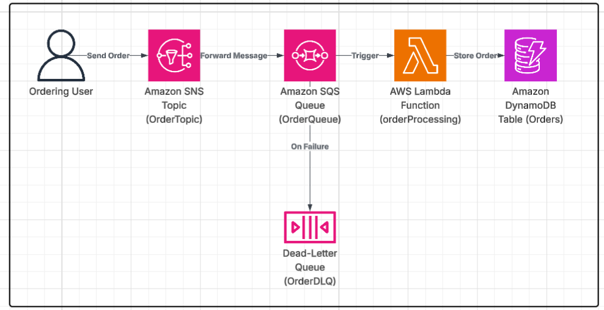

# CloudComputingA2
This project implements a simplified backend system for an e-commerce platform using AWS serverless services. The system accepts orders, stores them in a database, sends notifications, and handles failures using an event-driven architecture.

Amazon SNS -> Event broadcast (OrderTopic)

Amazon SQS -> Message queuing (OrderQueue)

AWS Lambda -> Serverless processing (orderProcessing)

Amazon DynamoDB -> NoSQL database (Orders table)

Dead-Letter Queue (DLQ) -> Reliable error handling (OrderDLQ)

Setup Instructions: 

1- Create DynamoDB Table

Table name: Orders

Partition Key: orderId (String)

2- Create SNS Topic

Name: OrderTopic

3- Create SQS Queues

Main queue: OrderQueue

Dead-Letter Queue: OrderDLQ

Set maxReceiveCount = 3 on OrderQueue and attach OrderDLQ

4- Create Lambda Function

Language: Python

Add trigger: SQS -> OrderQueue

Permissions: Grant AmazonDynamoDBFullAccess

5- Test the System

Publish a test message to SNS

Verify flow: SNS -> SQS -> Lambda -> DynamoDB -> Logs

The flow of data is:

1- An ordering user submits a new order.

2- The order is published to an Amazon SNS Topic.

3- The SNS topic delivers the message to an Amazon SQS Queue.

4- The AWS Lambda function is triggered by the SQS queue.

5- The Lambda function processes the message and stores the order in Amazon DynamoDB.

6- If the Lambda fails to process the message after 3 attempts, it is moved to a Dead-Letter Queue (DLQ).

Visibility timeout is the period during which a message becomes invisible to other consumers after being picked up. If the Lambda function processes the message successfully, the message is deleted. If it fails or times out, the message becomes visible again and is retried. Visibility timeout prevents duplicate processing of the same message by multiple Lambda instances and gives the function a chance to complete its task before others can see it.
A DLQ stores messages that repeatedly fail processing. In this assignment, if the Lambda fails to process a message 3 times (maxReceiveCount = 3), the message is moved to the DLQ.
It prevents problematic messages from clogging the main queue and gives developers a chance to inspect and debug the failed data separately.
This actually happened to me during this assignment, I published the test order, and the message made it all the way to Lambda but then it failed because the Lambda didn’t have permission to write to DynamoDB. Since I hadn't set up the IAM role properly, the function kept failing. However thanks to the visibility timeout, the message wasn’t being processed in parallel, and after three failed attempts, it was moved to the DLQ automatically. 

